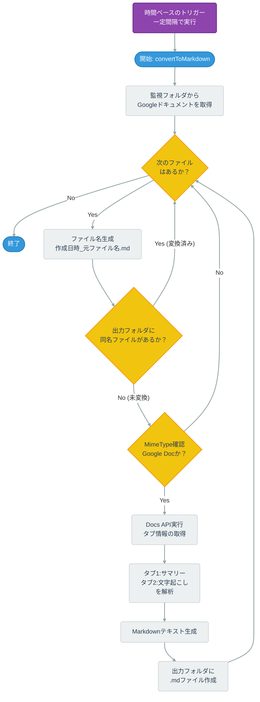

:::message
この記事は[**SMARTCAMP Advent Calendar 2025**](https://qiita.com/advent-calendar/2025/smartcamp) の12日目の記事です。
:::

## はじめに
みなさんは[GeminiによるGoogle Meetの議事録生成機能](https://support.google.com/meet/answer/14754931?hl=ja&co=GENIE.Platform%3DDesktop&oco=0)を使ったことがありますか？
筆者はもっぱら1on1で使用しています。

ミーティングが終了して少しすると、議事録としてGoogle ドキュメントが自動で生成されてメールで送信されるのでとても便利です。

内容としても「要約」・「文字起こし」の2セクションで構成されており、形式を問わず議事録として扱う分には何ら問題ないと思います。
(そして現状特に問題を感じていない方にはこの記事は刺さらないかもしれない)

筆者は日々の業務の様々なログを[Obsidian](https://obsidian.md/)というノートアプリで管理しているのですが、この議事録もMarkdownファイルとしてObsidianの管理下に置きたい気持ちが強くありました。

また、Geminiによる要約の出力をカスタマイズする機能は現時点で搭載されておらず指定のフォーマットで1on1議事録を管理したい筆者のスタイルには合わないものとなっていました。

今回はこれらの課題を解決するためにGASを使用してGoogle Meet議事録の生成を検知し、Markdownファイルに変換する仕組みを構築してきたので紹介したいと思います！

:::message
この記事では各ツール・サービスの使用方法については詳しく説明していません。
詳細は各ツール・サービスの公式ドキュメントや紹介記事を参照してください。
:::

## 全体像
今回紹介するシステムは👇のようになります。


*システム全体像 made by Figjam*

1. GeminiによってGoogle Drive上にGoogle Docs議事録が生成される。
2. 定期実行しているGASが議事録を保管しているディレクトリの差分を検知してMarkdownファイルに変換する。
3. 変換したMarkdownファイルを別の保管用ディレクトリに保存する。
4. Incoming Webhookを使用してSlackに変換完了の通知を送信する。
5. [PC版Google Driveのミラーリング機能](https://support.google.com/drive/answer/13401938?hl=ja&sjid=2108068346946079398-NC)を使用してローカルPC内のObsidian Vaultに変換後のMarkdownファイルを保存しているディレクトリを同期する。
6. 変換したMarkdownファイルをコンテキストとして渡し、Claude CodeのCustom Commandsを実行する。(ここだけは手動で行う必要がある)
7. 自分の好みのフォーマットで再生成された議事録がObsidian Vault内の別ディレクトリに保存される。

## GASでの処理
AIに作成してもらいました。いい時代ですね。
コード全てを説明すると長くなってしまうため処理フローを載せておきます。

自分は5分に1回実行するようにしていますが、必要に応じて変更してください。


:::details コードはこちら
```js:convertToMarkdown.js
// 監視する（元ファイルがある）フォルダのID
/** @type {string} */
const SOURCE_FOLDER_ID = 'YOUR_SOURCE_FOLDER_ID_HERE';

// Markdownを保存する（出力先）フォルダのID
/** @type {string} */
const DEST_FOLDER_ID = 'YOUR_DEST_FOLDER_ID_HERE';

// Slack Incoming Webhook URL
/** @type {string} */
const SLACK_WEBHOOK_URL = 'YOUR_SLACK_WEBHOOK_URL_HERE';

/**
 * Docs API のタブ情報
 * @typedef {Object} DocsTab
 * @property {{ body: string }} documentTab
 */

/**
 * 段落ブロック（Markdown生成用の中間表現）
 * @typedef {Object} ParagraphBlock
 * @property {string} typography - Docs の namedStyleType (HEADING_1, NORMAL_TEXT など)
 * @property {string[]} content  - 段落内のテキスト配列（要素を結合して1行のテキストにする）
 */

/**
 * メイン処理:
 * 監視フォルダ内の Google ドキュメントを全部見て、
 * 出力フォルダにまだ対応する Markdown ファイルがないものだけ変換する。
 */
const convertToMarkdown = () => {
  const srcFolder = DriveApp.getFolderById(SOURCE_FOLDER_ID);
  const destFolder = DriveApp.getFolderById(DEST_FOLDER_ID);

  const docsFiles = srcFolder.getFilesByType(MimeType.GOOGLE_DOCS);

  while (docsFiles.hasNext()) {
    const docFile = docsFiles.next();
    convertDocFileIfNeeded(docFile, destFolder);
  }
};

/**
 * 対象の Googleドキュメントについて、
 * まだMarkdownファイルが存在しない場合のみ変換を行う。
 *
 * @param {GoogleAppsScript.Drive.File} docFile - 元の Google ドキュメント
 * @param {GoogleAppsScript.Drive.Folder} destFolder - Markdown の出力先フォルダ
 */
const convertDocFileIfNeeded = (docFile, destFolder) => {
  const createdAt = docFile.getDateCreated();
  const mdFileName = buildMarkdownFileName(docFile.getName(), createdAt);

  if (hasExistingMarkdownFile(destFolder, mdFileName)) {
    return;
  }

  processFileWithDocsApi(docFile, destFolder, mdFileName);
};

/**
 * Googleドキュメントのファイル名から Markdown 用のファイル名を生成する
 * 作成日時 (YYYYMMDD-HHmm) を prefix として付けてソート性を高める
 *
 * @param {string} baseName - 元のファイル名
 * @param {Date} createdAt  - Googleドキュメントの作成日時
 * @returns {string} - 例: "20250121-2355_ファイル名.md"
 */
const buildMarkdownFileName = (baseName, createdAt) => {
  const ts = Utilities.formatDate(createdAt, Session.getScriptTimeZone(), "yyyyMMdd-HHmm");
  return `${ts}_${baseName}.md`;
};

/**
 * 出力先フォルダに同名の Markdown ファイルが存在するかどうかを判定する
 *
 * @param {GoogleAppsScript.Drive.Folder} folder
 * @param {string} fileName
 * @returns {boolean} - true の場合は既に Markdown ファイルが存在する
 */
const hasExistingMarkdownFile = (folder, fileName) => {
  const existing = folder.getFilesByName(fileName);
  return existing.hasNext();
};

/**
 * 1ファイル分の Docs → Markdown 変換を行い、出力フォルダに作成する
 *
 * @param {GoogleAppsScript.Drive.File} docFile - Google ドキュメントファイル
 * @param {GoogleAppsScript.Drive.Folder} destFolder - 出力先フォルダ
 * @param {string} mdFileName - 出力する Markdown ファイル名
 */
const processFileWithDocsApi = (docFile, destFolder, mdFileName) => {
  const docId = docFile.getId();
  const mimeType = docFile.getMimeType();
  const name = docFile.getName();

  if (mimeType !== MimeType.GOOGLE_DOCS) {
    console.log(`スキップ: Googleドキュメントではないファイル -> name=${name}, id=${docId}`);
    return;
  }

  try {
    const { tabs: [summaryTab, transcriptionTab] } = getDocTabs(docId);

    const summaryBlocks = parseTabBodyToBlocks(summaryTab);
    const transcriptionBlocks = parseTabBodyToBlocks(transcriptionTab);

    const allBlocks = [...summaryBlocks, ...transcriptionBlocks];

    const markdown = generateMarkdownFromParagraphBlocks(allBlocks);

    const createdFile = destFolder.createFile(mdFileName, markdown, MimeType.PLAIN_TEXT);
    console.log(`変換完了: ${name}`);

    // --- 成功通知 ---
    sendSlackNotification(
      `変換成功`,
      `Markdownファイルへの変換に成功しました。\n確認してください。\nファイル名：${docFile.getName()}\n元ファイル生成日時：${formatJapaneseDate(docFile.getDateCreated())}\nMarkdownファイル生成日時：${formatJapaneseDate(createdFile.getDateCreated())}`,
      'success'
    );

  } catch (e) {
    console.error(
      `Docs API で取得 or 変換中にエラー: name=${name}, id=${docId}, error=${e.message}`
    );

    // --- エラー通知 ---
    sendSlackNotification(
      `変換失敗`,
      `エラーが発生しました。\n確認してください。`,
      'error'
    );
  }
};

/**
 * Docs API を使ってタブ付きの Document を取得する。
 *
 * @param {string} docId - Google ドキュメントID
 * @returns {{ tabs: DocsTab[] }} - タブ配列を含んだオブジェクト
 */
const getDocTabs = (docId) => {
  /** @type {{ tabs?: DocsTab[] }} */
  const doc = Docs.Documents.get(docId, { includeTabsContent: true });
  const tabs = doc.tabs || [];

  if (!tabs.length) {
    throw new Error(`Tabs が取得できませんでした: id=${docId}`);
  }

  return { tabs };
};

/**
 * 1つのタブの body(JSON文字列) から ParagraphBlock[] を生成する。
 *
 * @param {DocsTab} tab
 * @returns {ParagraphBlock[]}
 */
const parseTabBodyToBlocks = (tab) => {
  if (!tab || !tab.documentTab || !tab.documentTab.body) {
    return [];
  }

  const bodyJson = JSON.parse(tab.documentTab.body);
  return extractParagraphBlocks(bodyJson.content || []);
};

/**
 * Docs API の content 配列から、Markdown用の ParagraphBlock 配列を生成する。
 *
 * @param {GoogleAppsScript.Document.Schema.StructuralElement[]} content
 * @returns {ParagraphBlock[]}
 */
const extractParagraphBlocks = (content) => {
  return content
    .map((item) => toParagraphBlock(item))
    .filter((block) => block && block.content.length > 0);
};

/**
 * 1つの StructuralElement を ParagraphBlock に変換する。
 * 段落以外の要素は空配列のブロックとして扱い、後の filter で除外される。
 *
 * @param {any} item - Docs API の StructuralElement
 * @returns {ParagraphBlock}
 */
const toParagraphBlock = (item) => {
  const typography = item.paragraph?.paragraphStyle?.namedStyleType || '';
  const content = extractTextElements(item.paragraph?.elements || []);

  return { typography, content };
};

/**
 * 段落内の elements からテキストのみを抽出する。
 * 空文字や「」など不要なテキストは除外。
 *
 * @param {any[]} elements
 * @returns {string[]}
 */
const extractTextElements = (elements) => {
  return elements.flatMap((element) => {
    const text = element.textRun?.content?.trim();

    // 不要なテキストは除外
    if (!text || text === '' || text === '') {
      return [];
    }

    return text;
  });
};

/**
 * ParagraphBlock 配列から Markdown を生成する。
 *
 * @param {ParagraphBlock[]} blocks
 * @returns {string} - Markdown 文字列
 */
const generateMarkdownFromParagraphBlocks = (blocks) => {
  if (!Array.isArray(blocks)) return '';

  let md = '';

  blocks.forEach((block) => {
    const { typography, content } = block;

    if (!content || content.length === 0) return;

    // content配列を一つのテキストに結合
    const lineText = content.join('').trim();
    if (lineText === '') return;

    md += convertLineToMarkdown(typography, lineText);
  });

  // 末尾に1つだけ改行を残す
  return md.trim() + '\n';
};

/**
 * 1行分のテキストを、Docs の typography 情報に応じて Markdown に変換する。
 *
 * @param {string} typography - Docs の namedStyleType
 * @param {string} lineText   - 段落のテキスト
 * @returns {string} - 改行込みの Markdown 行
 */
const convertLineToMarkdown = (typography, lineText) => {
  const headingPrefixMap = {
    HEADING_1: '# ',
    HEADING_2: '## ',
    HEADING_3: '### ',
  };

  const prefix = headingPrefixMap[typography];

  if (prefix) {
    return `${prefix}${lineText}\n\n`;
  }

  return `${lineText}\n\n`;
};

/**
 * Slack へ通知を送るユーティリティ関数
 * * @param {string} title - 通知のタイトル
 * @param {string} text - 通知の詳細本文
 * @param {'success' | 'error'} type - 通知タイプ (色分け用)
 */
const sendSlackNotification = (title, text, type) => {
  // 設定がない、またはプレースホルダーのままの場合はスキップ
  if (!SLACK_WEBHOOK_URL || SLACK_WEBHOOK_URL.includes('YOUR_SLACK_WEBHOOK_URL')) {
    console.warn('Slack Webhook URL が正しく設定されていないため、通知をスキップします。');
    return;
  }

  const color = type === 'success' ? '#36a64f' : '#ff0000';
  const emoji = type === 'success' ? ':white_check_mark:' : ':warning:';

  const payload = {
    attachments: [
      {
        color: color,
        blocks: [
          {
            type: "header",
            text: {
              type: "plain_text",
              text: `${emoji} ${title}`,
              emoji: true
            }
          },
          {
            type: "section",
            text: {
              type: "mrkdwn",
              text: text
            }
          }
        ]
      }
    ]
  };

  try {
    const options = {
      method: 'post',
      contentType: 'application/json',
      payload: JSON.stringify(payload),
      muteHttpExceptions: true
    };

    UrlFetchApp.fetch(SLACK_WEBHOOK_URL, options);
  } catch (e) {
    console.error(`Slack通知の送信に失敗しました: ${e.message}`);
  }
};

/**
 * 日付を「YYYY年MM月DD日 HH時mm分」形式の日本語表記にフォーマットする関数
 * @param {string | number | Date} date - フォーマット対象の日時。Date オブジェクト、UNIX time、ISO 文字列など。
 * @returns {string} フォーマット済みの日本語日時文字列
 */
const formatJapaneseDate = (date) => {
  const d = new Date(date);

  const year = d.getFullYear();
  const month = String(d.getMonth() + 1).padStart(2, "0");
  const day = String(d.getDate()).padStart(2, "0");

  const hour = String(d.getHours()).padStart(2, "0");
  const minute = String(d.getMinutes()).padStart(2, "0");

  return `${year}年${month}月${day}日 ${hour}時${minute}分`;
};
```
:::

### 注意するポイント
#### Docs APIについて
今回はGAS標準の[DocumentApp](https://developers.google.com/apps-script/reference/document/document-app?hl=ja)ではなく[Docs API](https://developers.google.com/workspace/docs/api/reference/rest?hl=ja)を使用してGoogle Docsを操作しています。

Geminiが生成する議事録はタブで分けられているのですが比較的新しめの機能であるタブ機能に `DocumentApp` が対応しておらず、1つ目のタブの情報しか取得できません。
GAS用に最適化されているわけではないため処理が煩雑になってしまいますがやむを得ずDocs APIを使用しています。

今後のアップデートに期待ですかね。

#### Google Meetの議事録保管ディレクトリについて
後で発覚したのですが議事録が保存されるディレクトリはMeet(またはGoogle Calenderにおける予定)のオーナーのマイドライブに生成されます。
そのため、誰がMeetを開催したか・予定を作成したかによってはマイドライブに議事録が保存されない可能性があります。

その場合、議事録が保存されるディレクトリを所有する人に別途ディレクトリを作成・アクセス権を付与してもらう等の対応が必要になるかもしれません。

#### ファイルの構造について
現時点の仕様ではGeminiによる議事録生成は「メモ」・「文字起こし」の2つのタブのみで構成されているため今回の実装もそれに合わせています。
将来の仕様変更で動かなくなる可能性があるのでその点はご了承ください。


## Slackへの通知
今回のフローで唯一手動で行わなければならない変換後議事録からのCustom Commandsによる再生成の実行漏れを防止するためにSlackのIncoming Webhookを使用して通知を送信するようにしています。

Incoming Webhookについてはすでに多くの記事で紹介されているためここでの説明は割愛します。


*こんな感じで通知される*

## ローカル環境への同期
ここでは詳しく説明しませんがObsidian Vault内のディレクトリにマウントしてます。
👇みたいな感じでGoogle Driveのファイルがローカルファイルのように扱えます。最高です。


https://support.google.com/drive/answer/13401938?hl=ja&sjid=2108068346946079398-NC

## おまけ：好みのフォーマットで議事録を再生成する
~~実はこっちが本編かも~~
以前はGoogle Docsの内容をまるごとコピペしてましたが、Markdownファイルを渡したときと比較すると精度が段違いです。(あくまで主観です)

筆者はClaude Codeで、 `/1on1-summary` というCustom Commandsを作成して議事録の生成という定型アクションを1アクションで実行できるようにしています。

:::details 1on1-summary.md
````md:1on1-summary.md
---
description: Google Meetの文字起こしから1on1サマリを生成し、指定された構造で保存します
argument-hint: [transcript-file] [person-name]
allowed-tools: Read, Write, Bash(mkdir:*), Bash(ls:*)
---

以下のタスクを実行してください：

## 入力情報
引数:
- 第1引数 ($1): Google Meetの文字起こしファイルのパス
- 第2引数 ($2): 1on1相手の名前

## 実行手順

### 1. ファイルの読み込み
第1引数 ($1) で指定されたファイルを読み込んでください。

### 2. サマリの生成
読み込んだ文字起こし内容を分析し、以下のテンプレート構造に従ってサマリを作成してください：

```markdown
---
with: [$2]
mood: [内容から読み取れる雰囲気・状態・空気感を一言で]
date: [ファイル名または内容から読み取れる日付 (YYYY-MM-DD形式)]
---

## TL;DR
[1on1全体の要約を2-3文で簡潔に記述]

## Topic Index
[話題をリスト形式で列挙]

## Topic
[各話題について詳細を記述。複数の話題がある場合は小見出しで区切る]

## Mood & Tone
[会話全体の雰囲気、相手の様子、感情的な側面について記述]

## Meta Review
[この1on1の振り返り、気づいたこと、次回に向けたアクション項目を記述]
```

### 3. ファイルの保存
生成したサマリを以下のパスに保存してください：
`1on1/$2/YYYY/MM/YYYY-MM-DD_$2.md`

- 日付は文字起こしファイル名または内容から抽出
- 必要なディレクトリは自動的に作成
- ファイル名の相手の名前は第2引数 ($2) の値を使用

### 4. 結果の報告
保存が完了したら、保存先のパスを表示してください。

## 注意事項
- 文字起こし内容は日本語で記述されています
- サマリも日本語で作成してください
- 相手のプライバシーに配慮し、機密情報は適切に扱ってください
- 雰囲気や感情の読み取りは、会話のトーンや言葉選びから推測してください
````
:::

### 出力例

:::details コンテキストとして渡すMarkdown変換後のGemini議事録(AI生成)
```md:田中太郎.md
## 【1on1】Aさん vs Bさん

招待済み

添付ファイル

会議の録画

### まとめ

BさんとAさんは1on1を行い、Aさんのプロジェクト進捗とキャリアに関する相談を実施した。Aさんは新しいダッシュボード機能の実装が順調に進んでおり、先週の技術的課題もチームメンバーの山田さんのアドバイスにより解決できたことを報告。また、マネジメントスキル習得への意欲を示し、小規模なチームリードや後輩メンタリングの経験を積みたいと相談した。Bさんは来月立ち上がる新機能開発プロジェクトでのリード役を提案し、Aさんはこれを快諾。2-3人の小規模チームから始め、徐々に責任範囲を広げていく方針で合意した。

### 詳細

プロジェクト進捗の報告Aさんは、新しいダッシュボード機能の実装が順調に進んでいることを報告した。先週話題になった技術的課題もクリアでき、今週中にはプロトタイプが完成する見込みであることを伝えた (00:01:30)。

技術課題の解決方法技術課題の解決について、Aさんはチームの山田さんに相談し、同様の課題を経験していた山田さんからのアドバイスが非常に役立ったと説明。また、公式ドキュメントを再度確認したところ見落としていた部分があったことも共有した。Bさんはチーム内でのコラボレーションが良い形で機能していることを評価し、山田さんへの感謝を伝える意向を示した (00:03:45)。

キャリアに関する相談Aさんは、技術面での成長を感じられるようになってきた一方で、次のステップとしてマネジメントスキルを身につけたいと相談。現在のプロジェクトではそうした機会が少ないと感じていることを率直に伝えた (00:08:20)。

マネジメント経験への意欲具体的な希望として、小規模でもチームリードのような役割を経験してみたいこと、後輩のメンタリングをもっと行いたいことを挙げた。Bさんはこれを良い考えだと評価し、来月から立ち上がる新機能開発プロジェクトで小規模チームが必要になるため、Aさんにリード役を検討していたことを伝えた (00:12:00)。

新プロジェクトでのリード役の提案Aさんは新プロジェクトでのリード役を快諾。Bさんは技術的な作業と並行してマネジメント業務も行うことになるため時間管理が重要になることを確認。Aさんは不安もありつつチャレンジしたい意向を示し、困った際は相談させてほしいと依頼した (00:18:30)。

今後の進め方の合意2-3人の小規模チームから始め、慣れてきたら徐々に責任範囲を広げていく方針で合意。定期的に状況を確認しながら進めることとし、新プロジェクトの詳細が決まり次第、来週改めて具体的な話をすることとした (00:25:00)。

## 【1on1】Aさん vs Bさん～文字起こし

### 00:00:00

Bさん:こんにちは、田中さん。今日もよろしくお願いします。Aさん:よろしくお願いします。今日は最近取り組んでいるプロジェクトの進捗と、ちょっと相談したいことがあって。Bさん:はい、ぜひ聞かせてください。

### 00:01:30

Aさん:まず進捗についてなんですが、新しいダッシュボード機能の実装は順調に進んでいます。先週お話しした技術的な課題はクリアできて、今週中にはプロトタイプが完成しそうです。Bさん:それは良かったです！前回の技術課題、結構大変そうでしたよね。どうやって解決したんですか？

### 00:03:45

Aさん:チームの山田さんに相談したら、似たような課題を以前経験していて。彼のアドバイスが本当に助かりました。あと、公式ドキュメントをもう一度よく読み直したら、見落としていた部分があって。Bさん:チームメンバーとのコラボレーションが良い形で機能していますね。山田さんにも感謝を伝えておきます。Aさん:はい、ありがとうございます。それで、相談したいのはキャリアのことなんですが...Bさん:はい、どうぞ。

### 00:08:20

Aさん:最近、技術面ではある程度成長を感じられるようになってきたんですが、次のステップとしてマネジメントスキルも身につけたいと思っていて。でも、今のプロジェクトだと、そういう機会が少ないかなと。Bさん:なるほど。マネジメントに興味を持ち始めたんですね。具体的にはどんなことをやってみたいですか？

### 00:12:00

Aさん:小規模でもいいので、チームリードのような役割を経験してみたいです。あとは、後輩のメンタリングももっとやってみたいと思っています。Bさん:いい考えですね。実は来月から新しい機能開発プロジェクトが立ち上がる予定で、そこで小規模なチームが必要になるんです。田中さんにリード役をお願いできないか検討していたところでした。Aさん:本当ですか？ぜひやらせていただきたいです！

### 00:18:30

Bさん:ただし、技術的な作業と並行してマネジメント業務も行うことになるので、時間管理がより重要になります。その点は大丈夫ですか？Aさん:はい、そこはちょっと不安もありますが、チャレンジしてみたいです。もし困ったら相談させてもらえますか？Bさん:もちろんです。定期的に状況を確認しながら進めましょう。

### 00:25:00

Bさん:最初は2-3人の小規模チームから始めて、慣れてきたら徐々に責任範囲を広げていく形でどうでしょう。Aさん:ありがとうございます！不安もありますが、すごく楽しみです。Bさん:他に気になることや、サポートが必要なことはありますか？Aさん:今のところは大丈夫です。新しいプロジェクトの詳細が決まったら、また教えてください。Bさん:わかりました。では来週、もう少し具体的な話をしましょう。今日はありがとうございました。Aさん:こちらこそ、ありがとうございました！

### 00:30:00 より後に文字起こしが終了しました

この編集可能な文字起こしはコンピュータが生成したものであり、誤りが含まれている可能性があります。作成後にテキストを変更することもできます。
```
:::
```md:出力例
---
with: 田中太郎
mood: 前向きで意欲的
date: 2025-12-11
---

## TL;DR
田中さんは現在のプロジェクトが順調に進んでおり、技術面での成長を実感している。今後のキャリアとしてマネジメントスキルの習得に興味を持っており、来月から始まる新プロジェクトでチームリードの機会を提供することで合意した。

## Topic Index
- ダッシュボード機能の開発進捗
- 技術課題の解決方法とチーム連携
- キャリア志向の変化（マネジメントへの関心）
- 新プロジェクトでのチームリード機会
- 時間管理とサポート体制

## Topic

### プロジェクト進捗：ダッシュボード機能開発
新しいダッシュボード機能の実装は順調で、今週中にプロトタイプ完成予定。前回の1on1で話題になった技術的な課題はクリアできた。

### 技術課題の解決プロセス
チームメンバーの山田さんへの相談が功を奏し、似た経験を持つ彼からのアドバイスが解決の鍵に。加えて、公式ドキュメントの再確認により見落としていた情報を発見。チーム内のナレッジシェアがうまく機能している好事例。

### キャリア志向：マネジメントへの関心
技術面では成長を実感できるようになってきた一方で、次のステップとしてマネジメントスキルの習得に興味を持ち始めている。具体的には、小規模チームのリード役や後輩のメンタリングを経験したいとのこと。

### 新たな機会の提示
来月から立ち上がる新機能開発プロジェクトで、小規模チームのリード役を打診。田中さんは強い意欲を示し、時間管理への不安はあるものの、チャレンジしたいとの意思を表明。

### 段階的なアプローチで合意
最初は2-3人の小規模チームから始め、慣れてきたら徐々に責任範囲を広げていく方針で合意。定期的に状況確認を行いながら進めることで、サポート体制を明確化。

## Mood & Tone
全体的に前向きで明るい雰囲気。田中さんは現在の仕事に自信を持ち始めており、次のステップへの期待と適度な緊張感がバランスよく表れていた。新しい機会の提示に対しては、不安よりも期待の方が大きく、成長意欲が強く感じられる。チーム内での良好な人間関係も構築できており、心理的安全性が確保されている様子。

## Meta Review

### 良かった点
- 田中さんの成長実感とキャリア志向の変化を適切なタイミングでキャッチできた
- 具体的な機会（チームリードの役割）を即座に提示できたことで、モチベーション向上につながった
- 段階的なアプローチを提案し、不安を軽減しつつチャレンジの機会を提供できた

### 気づいたこと
- チーム内のナレッジシェア（山田さんとの相談）がうまく機能している
- 技術面での成長が自信につながり、次のステップを考えられる余裕が生まれている
- サポート体制の明確化が重要（定期的な状況確認の約束）

### アクション項目
- [ ] 新プロジェクトの詳細を来週までに整理し、田中さんに共有
- [ ] 山田さんに対し、田中さんへのサポートへの感謝を伝える
- [ ] チームリードとして必要なスキルや心構えに関するリソースを田中さんに提供
- [ ] 定期的なフォローアップミーティングのスケジュールを設定（週次または隔週）
- [ ] 田中さんのマネジメントスキル向上を支援するためのメンター体制を検討
```

## おわりに
今まで手作業でコピペしていた作業がたった1アクションで完結するようになり、かなり非効率を削減できました。

今回のフローを自力で実装しようとすると骨の折れる作業量になりそうだったのですが、欲しいものを言語化するだけでAIが代わりに作ってくれる今の時代は本当に素晴らしいなと感じます。

Obsidianによるログ蓄積とAIのシナジーの良さは少し前から言われていますが筆者も最近それをひしひしと感じています。

これからもどんどん業務効率化を進めていきたいと思います！